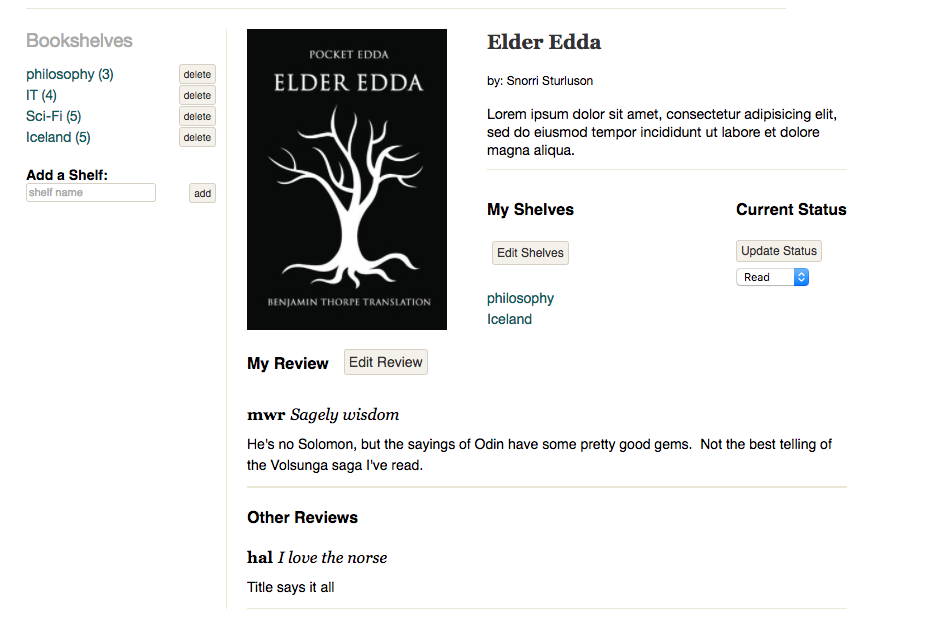

# GoodBooks

<a href="http://goodbooks.heroku.com">GoodBooks</a>

GoodBooks is a full-stack {db: 'Postgres', backEnd: 'Ruby on Rails', frontEnd: 'React/Redux'} web application inspired by GoodReads.  

At it's heart, GoodBooks aims to serve two purposes: 1) storing/organizing information
2) connecting enthusiasts of an otherwise solitary activity.  

Primarily it is a vehicle for readers to quickly store, sort, and access information about books.  Readers often wish to categorize books for easy recall later, log books they would like to read, and make notes to remember specific passages or thoughts about a book.  

Secondarily, Goodbooks aims to act as a platform for those who like to share thoughts and make personal connections with other readers.

GoodBooks is and will remain open source.

# Current Features & Implementation Details

## Shelves
The primary unit of organization is a shelf.  Shelves contain references to as many books as a thinks appropriate.  

To ensure maximum utility, shelves can easily created, destroyed, accessed or updated from a sidebar attached to every view on the site.  

## Book Detail
The main source for information storage and retrieval about a book is the book detail view.  To permit ease of use, this page can be accessed from any shelf index or browse view that lists the book.  

The book detail view contains basic information about the book (cover, title, author), an editable list of shelves the user has placed the book on,  the current read status of the book, and reviews.  From this one location the user is able to access all of the information s/he has stored about the book, as well as easily branch out to related views (e.g. other shelves the book is on).

## Reviews
This is the only feature that serves the secondary purpose of GoodBooks at the moment.  The detail view of any book will list the users review, followed by the reviews of other users.  

)

## Data Structure:

### Back end
Users and Books are the two primary models.  Shelves are the only secondary model, dependent on users.  Shelved_book and read_status subordinate join tables exist to facilitate rapid and targeted access of data and avoid redundant data storage.  

### Front end
Upon signing in, the redux store fetches the current users's username, shelf-overview (shelf-title and count), books, and read-statuses.  This is the most basic slice of information required from every view.  Shelf details (specific books), book details, and reviews are only fetched when the user attempts to access this information.  This division of labor keeps the front end datastore stocked to be maximally useful in the event of a lag, while light enough to respond rapidly to user actions.

# Features In the Making
This is an actively maintained project, to which I plan to add:

## Search
As the database grows, browsing books will quickly become a chore.  To remedy this I plan to add Search functionality.  The Fuse.js library will provide a great deal of flexibility as the site grows to search by title, author, user, or shelves.

## Sort
As a user's library grows some shelves will become unwieldy.  Allowing the user to sort by title, author, and read-status added will help ensure the site remains useful for frequent users.

## Author Accounts
Users of the site who are themselves authors will have a page that lists all of their books and a blog to communicate with their fans.  They will also be able to edit information about their books.  

## Librarian Accounts
To ensure the site is engaging, we let anyone add books.  This practice inevitably leads to some duplication of data.  Librarians will be authorized to merge book records.  

## Messages
Users who find the reviews or shelves of others compelling will soon be able to message one another to further discuss their shared interests.
